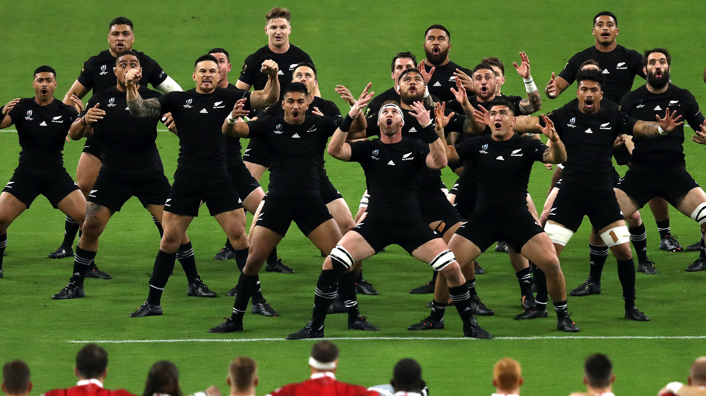

### Haka

Source: [RugbyPass](https://www.rugbypass.com/news/english-football-star-mocks-haka-as-world-rugby-makes-epic-fail/)

#### More Images

##### Dreamstime

* [Maori men performing haka, New Zealand](https://www.dreamstime.com/group-kapa-haka-traditional-maori-dance-performers-men-foreground-doing-form-challenge-photographed-tauranga-image141854426)

##### Radio New Zealand

* [Inappropriate haka use: 'It was mana-diminishing'](https://www.rnz.co.nz/news/te-manu-korihi/381822/inappropriate-haka-use-it-was-mana-diminishing)

##### Te Ara — The Encyclopedia of New Zealand

* [Āpirana Ngata at Waitangi](https://teara.govt.nz/en/photograph/35933/apirana-ngata-at-waitangi)

##### XV Mondial

* [Angleterre - Nouvelle-Zélande : le Haka en vidéo](http://www.quinzemondial.com/actualites-international/angleterre-nouvelle-zelande-le-haka-en-video-200891)

#### References

##### Maori.com

* [Maori Haka](https://www.maori.com/haka)

##### New Zealand Tourism — 100% Pure New Zealand

* [Haka - Māori war dances](https://www.newzealand.com/nouvelle-z%C3%A9lande/feature/haka/)

#### References

##### The Guardian

* [The haka isn’t yours – stop performing it](https://www.theguardian.com/world/commentisfree/2020/jan/23/the-haka-isnt-yours-stop-performing-it)
