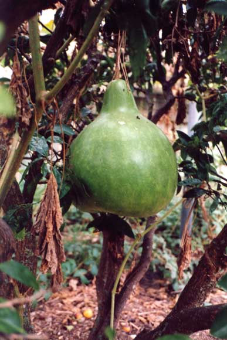

### Hue

#### Hue – gourd

> The hue (Polynesian bottle gourd) was used in a number of ways
> in New Zealand. Smaller fruits were eaten, while larger hue were
> used to hold water or preserved food.

Source: [Te Ara — The Encyclopedia of New Zealand](https://teara.govt.nz/en/photograph/17491/hue-gourd)

#### More Images

##### Te Ara — The Encyclopedia of New Zealand

* [Hue container](https://teara.govt.nz/en/photograph/17502/hue-container)
* [Hue (gourd container)](https://teara.govt.nz/en/object/37124/hue)

#### References

##### National Library of New Zealand

###### June 1962

* [Gardening: Growing Maori Gourds](http://teaohou.natlib.govt.nz/journals/teaohou/issue/Mao39TeA/c31.html)

##### Te Ara — The Encyclopedia of New Zealand

* [Story: Ngā tupu mai i Hawaiki – plants from Polynesia](https://teara.govt.nz/en/nga-tupu-mai-i-hawaiki-plants-from-polynesia/page-2)

##### Te Māra Reo — The Language Garden

* [Hue](http://www.temarareo.org/TMR-Hue.html)

##### Wikipedia

* [Gourd](https://en.wikipedia.org/wiki/Gourd)
