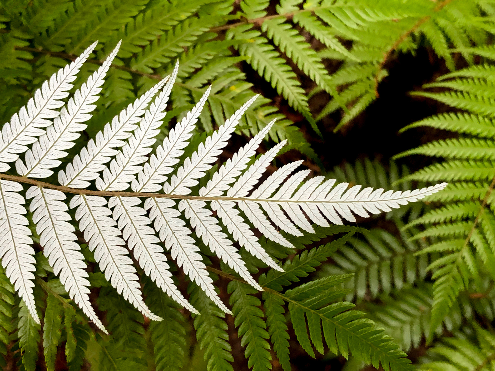

### Silver Fern

Source: [Flying Fish](https://flyingfishsail.wordpress.com/2019/04/04/the-new-zealand-fern/)

#### More Images

##### Eric Bréchemier on Flickr

* [Native Fern](https://www.flickr.com/photos/eric_brechemier/3324116234/in/album-72157611251752316/)

##### Photos.com

* [New Zealand Fern](https://photos.com/featured/new-zealand-fern-alkalyne.html)

##### Silver Fern Flag

* [Why is the Silver Fern New Zealand's Symbol?](https://www.silverfernflag.org/press/why-is-the-silver-fern-new-zealands-symbol)

##### Wikipedia

* [Silver Fern](https://en.wikipedia.org/wiki/File:Silver-fern.jpg)
* [Silver fern flag](https://en.wikipedia.org/wiki/File:Silver_fern_flag.svg)

#### References

##### Flying Fish

* [The New Zealand Fern](https://flyingfishsail.wordpress.com/2019/04/04/the-new-zealand-fern/)

##### Silver Fern Flag

* [Why is the Silver Fern New Zealand's Symbol?](https://www.silverfernflag.org/press/why-is-the-silver-fern-new-zealands-symbol)

##### Wikipedia

* [Alsophila dealbata](https://en.wikipedia.org/wiki/Alsophila_dealbata)
* [Silver fern flag](https://en.wikipedia.org/wiki/Silver_fern_flag)
* [List of native New Zealand ferns](https://en.wikipedia.org/wiki/List_of_native_New_Zealand_ferns)
