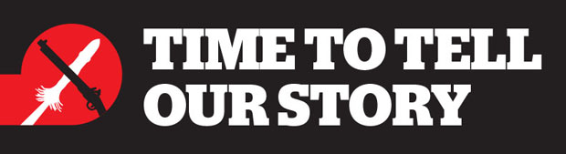

### Time To Tell Our Story

Source: [Stuff](https://www.stuff.co.nz/opinion/107003588/time-to-tell-our-stories)

> A push to ensure New Zealand history is taught in the country's schools
> in a coherent manner has paid off, with the prime minister announcing
> changes to the curriculum.
>
> Jacinda Ardern said on Thursday morning [September 12th, 2019] all schools
> and kura would be expected, by 2022, to teach the country's history.
>
> Curriculum changes being made would reset a national framework so that all
> learners and ākonga were aware of key aspects of New Zealand history and how
> they had influenced and shaped the nation, Ardern said.
>
> Aspects of New Zealand's history to be covered were expected to include the
> arrival of Māori to Aotearoa; first encounters and early colonial history,
> the Treaty of Waitangi and its history; colonisation of, and immigration to,
> Aotearoa; the New Zealand Wars; the evolving national identity of New
> Zealand in the late 19th and early 20th centuries; and the country's role
> in the Pacific.
>
> — https://www.stuff.co.nz/national/education/115712569/new-zealand-history-to-be-taught-in-schools-by-2022-says-pm-jacinda-ardern

> * The arrival of Māori to Aotearoa New Zealand
> * First encounters and early colonial history of Aotearoa New Zealand
> * Te Tiriti o Waitangi / Treaty of Waitangi and its history
> * Colonisation of, and immigration to, Aotearoa New Zealand, including the New Zealand Wars.
> * Evolving national identity of Aotearoa New Zealand in the late 19th and early 20th Centuries
> * Aotearoa New Zealand's role in the Pacific
> * Aotearoa New Zealand in the late 20th century and evolution of a national identity with cultural plurality.
>
> — https://www.rnz.co.nz/news/national/398599/new-zealand-history-will-be-compulsory-in-all-schools-by-2022

#### More Images

#### References

##### RNZ Radio New Zealand

###### September 12th, 2019

* [New Zealand history will be compulsory in all schools by 2022](https://www.rnz.co.nz/news/national/398599/new-zealand-history-will-be-compulsory-in-all-schools-by-2022)

##### Stuff

###### August 25th, 2016

* [Editorial: Bring NZ Wars out of the shadows](https://www.stuff.co.nz/dominion-post/comment/editorials/83518542/editorial-bring-nz-wars-out-of-the-shadows?rm=m)

###### April 6th, 2018

* [New Zealand Land Wars should be taught in high school, says Waikato history teacher](https://www.stuff.co.nz/national/education/102488733/new-zealand-land-wars-should-be-taught-in-high-school-says-waikato-history-teacher?rm=m)

###### August 1st, 2018

* [NZ Made/Nā Nīu Tīreni: The unsettling truth about the Treaty](https://www.stuff.co.nz//national/105907699/nz-maden-nu-treni-the-unsettling-truth-about-the-treaty)
* [The unsettling truth about the Treaty](https://interactives.stuff.co.nz/2018/07/na-niu-tireni-new-zealand-made/)

###### August 2nd, 2018

* [Treaty of Waitangi: What was lost](https://www.stuff.co.nz//national/104100739/treaty-of-waitangi-what-was-lost)
* [Treaty and Me: The blending of two peoples](https://www.stuff.co.nz//national/105538810/treaty-and-me-the-blending-of-two-peoples)

###### August 3rd, 2018

* [The amount allocated to Treaty of Waitangi settlements is tiny, compared with other Government spending](https://www.stuff.co.nz/national/104205997/the-amount-allocated-to-treaty-settlements-is-tiny-compared-with-other-government-spending)

###### August 6th, 2018

* [A mature nation owns its history - the good and the bad](https://www.stuff.co.nz//national/106043529/a-mature-nation-owns-its-history--the-good-and-the-bad)

###### August 28th, 2019

* [Teachers' final stoush to have New Zealand history mandatory in schools' teachings](https://www.stuff.co.nz/national/education/115332761/teachers-final-stoush-to-have-new-zealand-history-mandatory-in-schools-teachings?rm=m)

###### September 2nd, 2018

* [Fund to allow whānau, hapū and iwi to tell stories of New Zealand Wars](https://www.stuff.co.nz/national/106760154/fund-to-allow-whnau-hap-and-iwi-to-tell-stories-of-new-zealand-wars?rm=m)

###### September 12th, 2018

* [Time to tell our stories](https://www.stuff.co.nz/opinion/107003588/time-to-tell-our-stories)
* [One school's battle to remember the wars that shaped NZ](https://www.stuff.co.nz/national/education/106976446/one-schools-battle-to-remember-the-wars-that-shaped-nz?rm=m)

###### September 13th, 2018

* [Calls to make NZ Wars compulsory learning fails to find favour with Education Minister](https://www.stuff.co.nz/national/education/107007875/calls-to-make-nz-wars-compulsory-learning-fails-to-find-favour-with-education-minister?rm=m)

###### September 25th, 2018

* [Teaching about NZ Wars helps Hamilton students find identity](https://www.stuff.co.nz/national/education/107281831/teaching-about-nz-wars-helps-hamilton-students-find-identity?rm=m)

###### February 6th, 2019

* [Petition reignites debate over teaching New Zealand's colonial history in schools](https://www.stuff.co.nz/national/education/110346303/petition-reignites-debate-over-teaching-new-zealands-colonial-history-in-schools)

###### May 31st, 2019

* [Petition pushes for teaching of NZ history in all schools](https://www.stuff.co.nz/national/education/113156935/petition-pushes-for-teaching-of-nz-history-in-all-schools?rm=a)

###### September 12th, 2019

* [New Zealand history to be taught in schools by 2022, says PM Jacinda Ardern](https://www.stuff.co.nz/national/education/115712569/new-zealand-history-to-be-taught-in-schools-by-2022-says-pm-jacinda-ardern)

##### Te Ara — The Encyclopedia of New Zealand

* [Te Ara – a history: Māori content, biculturalism and translation](https://teara.govt.nz/en/te-ara-a-history/page-5)
* [Map of New Zealand with iwi](https://teara.govt.nz/en/map/45555/map-of-new-zealand-with-iwi)
