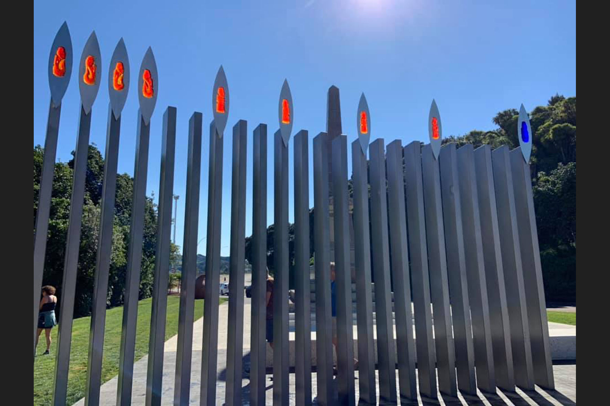

### Puhi Kai Iti / Cook Landing Site National Historic Reserve

###### Nine pou to represent the men shot in the encounter with Endeavour crew

Source: [Eugenie Sage MP on Facebook, September 27th, 2019](https://www.facebook.com/EugenieSageMP/posts/2868526743175692)

#### More Images

##### Eugenie Sage MP on Facebook

* [Eugenie Sage MP on Facebook, September 27th, 2019](https://www.facebook.com/EugenieSageMP/posts/2868526743175692)

##### Google Maps

* [Cook Landing Site National Historic Reserve](https://goo.gl/maps/uPaDgkT7ZJMUJygn8)

#### References

##### Department of Conservation of New Zealand

* [Puhi Kai Iti/Cook Landing National Historic Reserve](https://www.doc.govt.nz/parks-and-recreation/places-to-go/east-coast/places/gisborne-area/cook-landing-national-reserve/)
* [The Turanganui River: a brief history](https://www.doc.govt.nz/Documents/conservation/historic/by-region/echb/turanganui-river-history.pdf)

##### Te Ao — Māori News

###### October 1st, 2019

* [Māori stories of arrival recognised](https://www.teaomaori.news/maori-stories-arrival-recognised)

##### Twin Berth

* [Eastland Port Development Project: Iwi & Community](http://www.twinberth.nz/iwi-and-community/)

##### Wikipedia

* [National reserves of New Zealand](https://en.wikipedia.org/wiki/National_reserves_of_New_Zealand)
