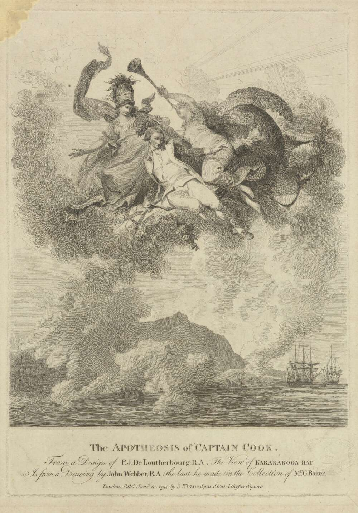
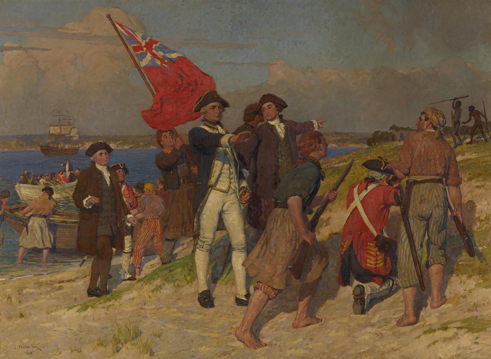

### Captain Cook Legacy

Source: [National Library of Australia](https://catalogue.nla.gov.au/Record/2065859)

> The Apotheosis of Captain Cook, 20 January 1794  
> 31 x 21.9 cm  
> Engraving published by John Thane on 20 January 1794 in London  
> after a design by Philippe Jacques de Loutherbourg  
> after a drawing of Karakakooa Bay by John Webber  

#### More Images

##### AFAR

* [The Lighthouse by Michael Parekowhai](https://www.afar.com/places/the-lighthouse-by-michael-parekowhai-auckland)

##### Art Gallery NSW, Australia

* [The apotheosis of Captain Cook (1794)](https://www.artgallery.nsw.gov.au/collection/works/15.1992/)

##### Department of Conservation, New Zealand

* [The Turanganui River, A Brief History, October 2006](https://www.doc.govt.nz/Documents/conservation/historic/by-region/echb/turanganui-river-history.pdf)

##### National Gallery of Victoria, Melbourne

* [Landing of Captain Cook at Botany Bay, 1770](https://www.ngv.vic.gov.au/explore/collection/work/5576/)

> E. Phillips Fox  
> Landing of Captain Cook at Botany Bay, 1770 1902  
> oil on canvas  
> 192.2 × 265.4 cm  
> National Gallery of Victoria, Melbourne  
> Gilbee Bequest, 1902  
> Photo: National Gallery of Victoria, Melbourne  

##### our Auckland

* [The Lighthouse lights up](https://ourauckland.aucklandcouncil.govt.nz/news/2017/02/the-lighthouse-michael-parekowhai/)

##### RNZ Radio New Zealand

* [Te Papa acquires painting from Cook voyage with 'portrayal of our tīpuna'](https://www.rnz.co.nz/news/national/389655/te-papa-acquires-painting-from-cook-voyage-with-portrayal-of-our-tipuna)
* [Peter Ireland and the weight of Captain Cook](https://www.rnz.co.nz/national/programmes/standing-room-only/audio/2018689935/peter-ireland-and-the-weight-of-captain-cook)

##### Royal Academy of Arts, UK

* [The Apotheosis of Captain Cook (20 January 1794)](https://www.royalacademy.org.uk/art-artists/work-of-art/the-apotheosis-of-captain-cook)

##### Royal Museums Greenwich, UK

* [The Apotheosis of Captain Cook](https://www.rmg.co.uk/collections/objects/rmgc-object-107046)

#### References

##### AFAR

* [The Lighthouse by Michael Parekowhai](https://www.afar.com/places/the-lighthouse-by-michael-parekowhai-auckland)

##### Captain Cook Birthplace Museum

* [ It is housed in a purpose-built building close to the granite urn marking the site of Cook’s birthplace cottage in Stewart Park, Marton, Middlesbrough](https://www.captcook-ne.co.uk/ccbm/)

##### Captain Cook Memorial Museum Whitby

* [The Museum is in the 17th century house where he lodged as an apprentice when not at sea](https://www.cookmuseumwhitby.co.uk/)

##### Captain Cook Society

* [Welcome to the Captain Cook Society](https://www.captaincooksociety.com/)

##### Contemporary HUM

###### September 21st, 2018

* [Mana Moana in the UK’s year of Captain Cook](https://contemporaryhum.com/writing/mana-moana-in-the-uks-year-of-captain-cook/)

##### National Maritime Museum, UK on Future Learn

* [Confronting Captain Cook: Memorialisation in museums and public spaces](https://www.futurelearn.com/courses/captain-cook)

##### our Auckland

* [The Lighthouse lights up](https://ourauckland.aucklandcouncil.govt.nz/news/2017/02/the-lighthouse-michael-parekowhai/)

##### RNZ Radio New Zealand

###### May 20th, 2019

* [Te Papa acquires painting from Cook voyage with 'portrayal of our tīpuna'](https://www.rnz.co.nz/news/national/389655/te-papa-acquires-painting-from-cook-voyage-with-portrayal-of-our-tipuna)

###### October 2nd, 2019

* [Iwi to receive message expressing regret for Māori killed in James Cook meeting](https://www.rnz.co.nz/news/te-manu-korihi/400095/iwi-to-receive-message-expressing-regret-for-maori-killed-in-james-cook-meeting)

##### Royal Museums Greenwich, UK

* [Research guide N2: Captain James Cook](https://www.rmg.co.uk/collections/research-guides/research-guide-n2-captain-james-cook)
* [Pacific Encounters](https://www.rmg.co.uk/national-maritime-museum/attractions/sackler-gallery-pacific-encounters)

##### Smithsonian

* [British Government ‘Expresses Regret’ for Māori Killed After James Cook’s Arrival in New Zealand](https://www.smithsonianmag.com/smart-news/british-government-expresses-regret-maori-killed-after-james-cooks-arrival-new-zealand-180973270/)

##### The Guardian

###### January 18th, 2022

* [How to kill a god: the myth of Captain Cook shows how the heroes of empire will fall](https://www.theguardian.com/news/2022/jan/18/how-to-kill-a-god-captain-cook-myth-shows-how-heroes-of-empire-will-fall)

