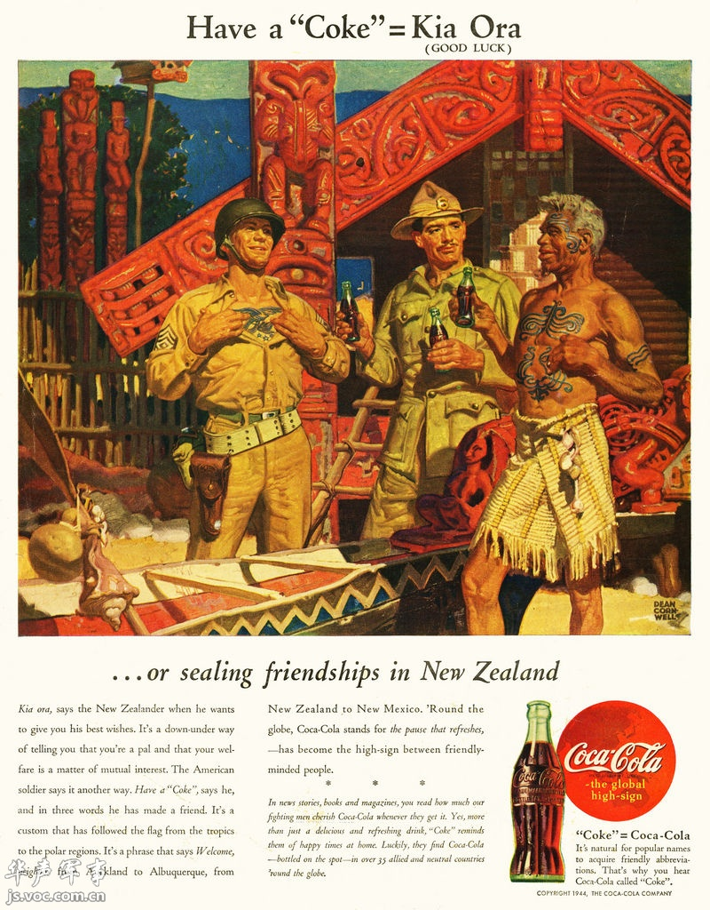
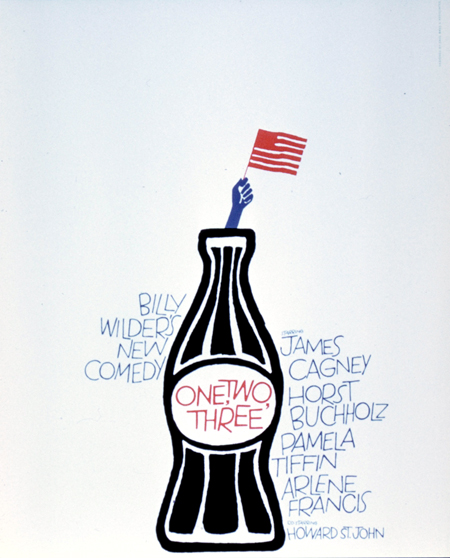
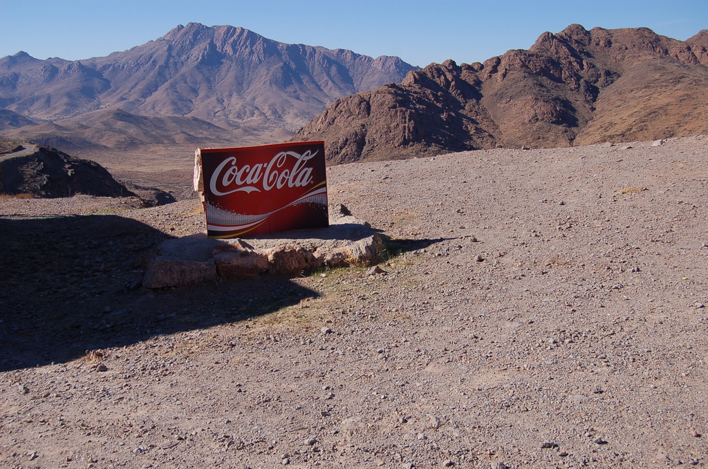

### Cocacolonization

  
*1944 magazine ad*

Source: [reddit](https://www.reddit.com/r/newzealand/comments/7rmyoq/ww2_era_coca_cola_kiaora_advertisement/)

> On 15 January 1889, the Coca-Cola Company
> —then known as the Pemberton Medicine Company—
> was originally incorporated in Georgia, US.
> At the time it was incorporated, the company sold
> Pemberton's Indian Queen Hair Dye, Pemberton's Globe Flower Cough Syrup,
> and Pemberton's French Wine Cola
> —a moderately successful health drink made from extracts
> of the coca leaf and kola nut. French Wine Cola was the predecessor
> to the famous Coca-Cola.
>
> Although New Zealand has produced soft drinks since the 1830s,
> it was the in late 1930s that Coca-Cola began to frequent New Zealand shores.
> As Te Ara notes, "Coca-Cola was popularised by American servicemen
> in New Zealand during the Second World War. It was imported ready-made
> from 1939, and made locally from imported concentrate after 1944."
>
> The link between Coca-Cola and American servicemen can be seen
> in this kitschy and now politically-incorrect painting held
> at Archives New Zealand: warart.archives.govt.nz/node/1089.
> Dean Cornwell's "Have a "Coke" = Kia Ora" was painted c.1943-1945,
> and comes from the extensive collection of War Art. (...)
>
> — https://www.flickr.com/photos/archivesnz/11841204884/

#### More Images

##### Adbranch

* [Coca-Cola around the world, World War II](https://www.adbranch.com/coca-cola-around-the-world-world-war-ii/)

##### akg images

* [Coca-Cola, New Zealand / advert 1944](https://www.akg-images.com/CS.aspx?VP3=SearchResult&VBID=2UMESQ5ECSWY2N&SMLS=1&RW=1356&RH=775&POPUPPN=1&POPUPIID=2UMDHUB2B2B)

##### Archives New Zealand

* [Two soldiers and Maori with coke drinks ['Have a coke - Kia Ora']](https://archives.govt.nz/images/two-soldiers-and-maori-with-coke-drinks-have-a-coke-kia-ora)

##### ebay

* [1944 newspaper ad for Coca-Cola - US Soldier in New Zealand, Kia Ora, WW2 ad](https://www.ebay.com/itm/1944-newspaper-ad-for-Coca-Cola-US-Soldier-in-New-Zealand-Kia-Ora-WW2-ad-/333526356529)
* [1944 Coca-Cola Soda Ad - art by Dean Cornwell - Have a Coke = Kia Ora Good Luck](https://www.ebay.com/itm/1944-Coca-Cola-Soda-Ad-art-by-Dean-Cornwell-Have-a-Coke-Kia-Ora-Good-Luck-/224103097054)
* [1944 Coke New Zealand Maori & US soldier art Coca Cola vintage print ad](https://www.ebay.com/itm/1944-Coke-New-Zealand-Maori-US-soldier-art-Coca-Cola-vintage-print-ad-/363184243753)

##### Envisioning the American Dream

* [On the Front Lines with Coca Cola Pt II](https://envisioningtheamericandream.com/2013/05/30/on-the-front-lines-with-coca-cola-pt-ii/)

##### One Two Three poster by Saul Bass

##### reddit

* [WW2 era Coca Cola Kia-Ora Advertisement](https://www.reddit.com/r/newzealand/comments/7rmyoq/ww2_era_coca_cola_kiaora_advertisement/)

##### Taringa!

* [Coca-Cola alrededor del Mundo](https://www.taringa.net/+imagenes/coca-cola-alrededor-del-mundo_134ro6/%7B%7Bcanonical%7D%7D)

##### YouTube

###### Coca-Cola New Zealand

* [Coca-Cola Rugby](https://www.youtube.com/watch?v=HTkDTQpyn4w)
* [All Videos](https://www.youtube.com/c/cokenz/videos)

###### Encore +

* [The Cola Conquest Pt 1: The Big Sell — Documentary](https://www.youtube.com/watch?v=N4kvX1kgJ8Q)
* [The Cola Conquest Pt 2: Cola War and Peace — Documentary](https://www.youtube.com/watch?v=Rk2yAB6kKDY)
* [The Cola Conquest Pt. 3: Cola Colonization — Documentary](https://www.youtube.com/watch?v=n0uED6dHsDU)

###### Archives New Zealand on Flickr

###### Lehigh Global Studies

> After reading anthropologist Robert Foster's book "Coca Globalization:
> Following Soft Drinks from New York to New Guinea,"
> Lehigh University students Elif Anda '16 and Nadine Elsayed '16 composed
> this audiovisual commentary in response as a project in their Fall 2015
> Global Studies/Anthropology course "Cultural Studies and Globalization."

* [Coca Globalization](https://www.youtube.com/watch?v=NUzql4U5t8E)

###### One, Two, Three

* [Opening Sequence](https://www.youtube.com/watch?v=FZCOyPmYWMc)
* [Mach Mal pause... Trink Coca-cola](https://www.youtube.com/watch?v=c8szkcehoWg)
* [Tell him about Coca-Cola colonialism](https://www.youtube.com/watch?v=qyPAcl3GW7U)
* [We suppy the sirup, you do the bottling](https://www.youtube.com/watch?v=DD5AQluWoIM)

##### Wikimedia

###### Sign “Coca-Cola” in the mountains of the High Atlas, in Berber country (Morocco)

* [File:Coca-Cola Morocco.jpg](https://commons.wikimedia.org/wiki/File:Coca-Cola_Morocco.jpg)

#### References

##### Archives New Zealand on Flickr

* [Dean Cornwell, Have a "Coke" = Kia Ora, c.1943-1945](https://www.flickr.com/photos/archivesnz/11841204884/)

##### Envisioning the American Dream

* [On the Front Lines with Coca Cola Pt II](https://envisioningtheamericandream.com/2013/05/30/on-the-front-lines-with-coca-cola-pt-ii/)
* [I’d Like to Buy the World a Coke](https://envisioningtheamericandream.com/2015/05/20/id-like-to-buy-the-world-a-coke/)

##### IMDb

* [The Cola Conquest (1998)](https://www.imdb.com/title/tt0294464/)

##### JVJ Publihsing

* [Dean Cornwell](https://www.bpib.com/cornwell.htm)

##### NITV

###### October 15th, 2018

* ['Kia ora, Death': Vending machine slogan gets lost in translation](https://www.sbs.com.au/nitv/article/2018/10/15/kia-ora-death-vending-machine-slogan-gets-lost-translation)

##### Salesbeat Blog

* [Procter & Gamble or Coca Cola?](https://blog.salesbeat.co/2020/05/25/procter-gamble-or-coca-cola/)

##### StopPress

###### August 14th, 2015

* [Around the corner from everywhere: celebrating 100 years of the Coke bottle](https://stoppress.co.nz/news/around-corner-everywhere-celebrating-100-years-coke-bottle/)

##### The Coca-Cola Company

* [The Chronicle of Coca-Cola: A Symbol of Friendship](https://www.coca-colacompany.com/news/the-chronicle-of-coca-cola-a-symbol-of-friendship)

##### The Spinoff

###### September 10th, 2018

* [Why is Coca-Cola still selling a racist drink called Kia-Ora?](https://thespinoff.co.nz/food/beverage/10-09-2018/why-is-coca-cola-still-selling-a-racist-drink-called-kia-ora/)

##### Wikipedia

* [Cocacolonization](https://en.wikipedia.org/wiki/Cocacolonization)
* [Dean Cornwell](https://en.wikipedia.org/wiki/Dean_Cornwell)
* [Kia-Ora](https://en.wikipedia.org/wiki/Kia-Ora)
* [List of Coca-Cola slogans](https://en.wikipedia.org/wiki/List_of_Coca-Cola_slogans)
* [One, Two, Three](https://en.wikipedia.org/wiki/One,_Two,_Three)
