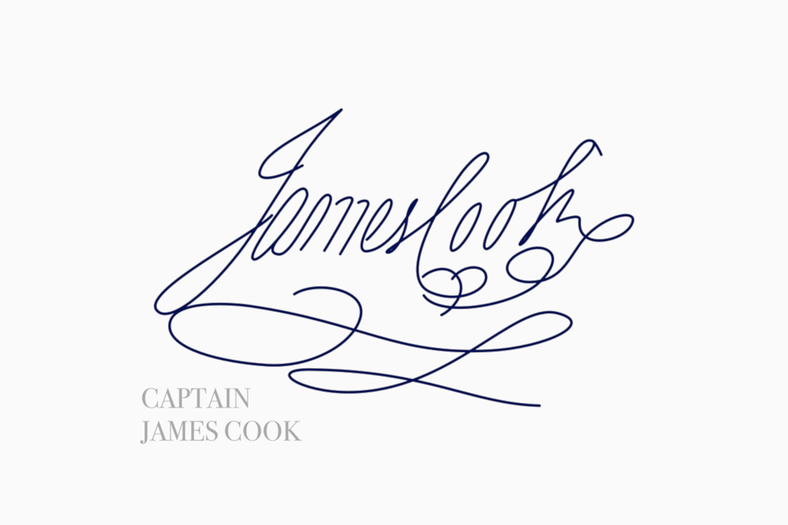

### James Cook Signature

Source: signature traced by [Jaison Justus](http://gallery.wacom.com/gallery/33975820/Signature-Series-Explorers)

#### More Images

##### Alamy

* [Letter bearing James Cook's signature](https://www.alamy.com/stock-photo-a-letter-by-captain-james-cook-bearing-his-signature-currently-on-54700954.html)

##### Project Gutenberg Australia

* [FACSIMILE OF TUESDAY, 23RD OCTOBER, 1770](http://gutenberg.net.au/ebooks/e00043.html#cook-14)
* [CAPTAIN COOK'S JOURNAL. FIRST VOYAGE.](http://gutenberg.net.au/ebooks/e00043.html)

##### Semantic Schola

* [Signature of James Cook (1776)](https://www.semanticscholar.org/paper/Burnet-of-Australia-IAN-Wood/39495e51c7797b65ea4bff232baa0e73c5f62ea4/figure/0)

##### Wikimedia Commons

* [James Cook Signature](https://commons.wikimedia.org/wiki/File:James_Cook_Signature.svg)

* [Act I: The First Voyage](https://lib-dbserver.princeton.edu/visual_materials/maps/websites/pacific/cook1/cook1.html)
* [Stamps from Royal Mail Commemorating 250th Anniversary of James Cook's Voyages](https://blog.norphil.co.uk/2018/08/250th-anniversary-of-captain-james.html)

