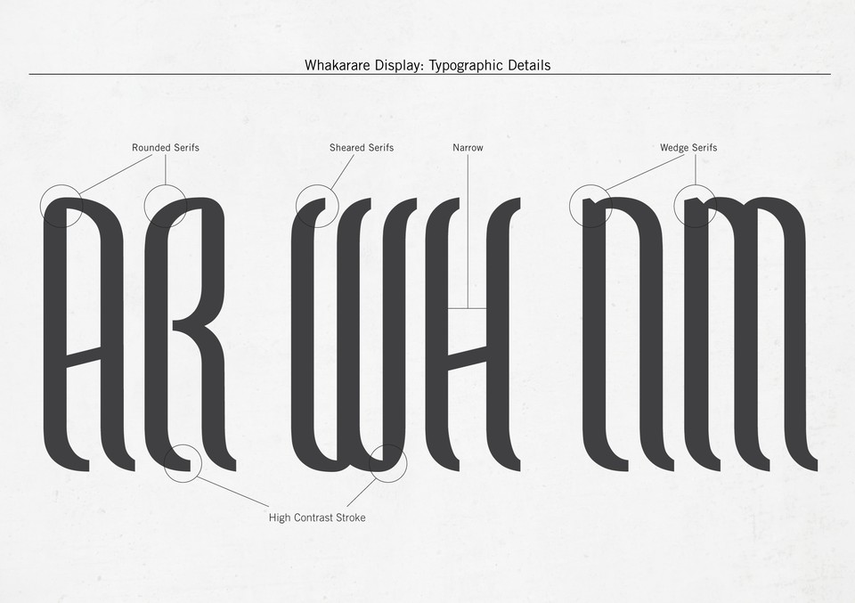

### Whakarare

Source: [Johnson Witehira](https://www.johnsonwitehira.studio/whakarare)

> (...) Starting with the observation that there are no authentic
> Māori typefaces, designed by Māori for Māori communities,
> Witehira traces the kaupapa Māori design process in which Māori
> cosmo-genealogy is transformed into structural characteristics
> of the Whakarare typeface. In Māori history, the world was created
> when the children of Ranginui (sky-father) and Papatūānuku (earth-mother),
> forcibly push their parents apart.
>
> (...) While the Whakarare typeface is designed to be Māori-centric,
> the authors demonstrate how the problem of designing forms that express
> the concept of compression and crushing, as a status immediately preceding
> an explosive expansion, is not specific to the Māori culture. Every designer
> in the world would face the same design challenge in a completely different
> context. The ability to design a form capable of generating that perception
> in the observer is not a trivial or easy task. On the contrary, its solution
> requires a very advanced knowledge of the psychology of perception and
> therefore has a universal, rather than local, significance.
>
> — https://unitec.researchbank.ac.nz/handle/10652/3368

#### More Images

* [Whakarare](https://www.johnsonwitehira.studio/whakarare)

#### References

##### AIGA

* [How the First Typeface Designed for the Māori Community is Changing the Way New Zealand Understands its Own Cultural Identity](https://eyeondesign.aiga.org/the-first-typeface-designed-specifically-for-the-maori-community-is-changing-how-new-zealand-views-its-own-cultural-identity/)

##### IDIA — INDIGENOUS DESIGN AND INNOVATION AOTEAROA

* [ROpU | Our team](https://www.idia.nz/ropu)

##### Johnson Witehira

* [Whakarare](https://www.johnsonwitehira.studio/whakarare)
* [About](https://www.johnsonwitehira.studio/about)
* [Half-blood Exhibition and Artworks](https://www.johnsonwitehira.studio/maorilandaventures)

#### Luc Devroye

* [Maori fonts](http://luc.devroye.org/maori.html)

##### Research Bank

* [The Whakarare Typeface Project : when culture-specific design brings elements of universal value](https://unitec.researchbank.ac.nz/handle/10652/3368)
* [The Whakarare Typeface Project [PDF]](https://unitec.researchbank.ac.nz/bitstream/handle/10652/3368/CUMULUSMI_2015_submission_76.pdf?sequence=1&isAllowed=y)

